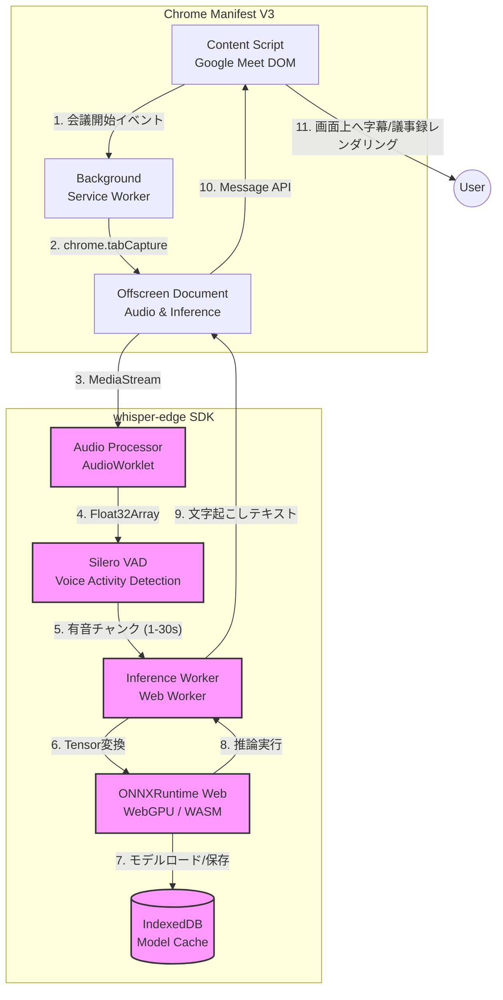

# whisper-edge システムアーキテクチャ設計書

## 1. システム構成図

本プロジェクトはブラウザのクライアントサイドで完結するため、Chrome Extension Manifest V3（MV3）の制約を回避しつつ、WebGPUの計算資源を最大限に引き出す構成とする。推論タスクはメインスレッドをブロックしないよう `Offscreen Document` 内の Web Worker で実行する。

## 2. モジュール責務

| モジュール名 | 責務 |
|---|---|
| **Content Script** | Google MeetのDOM監視、UIインジェクション（字幕表示・議事録エクスポート）。 |
| **Background (Service Worker)** | 拡張機能のライフサイクル管理、`chrome.tabCapture`を用いたタブ音声の取得、Offscreen Documentの生成と破棄。 |
| **Offscreen Document** | MV3でDOM/Audio APIにアクセスするための非表示ページ。AudioContextのホストおよびSDKのエントリーポイント。 |
| **Audio Processor** | `AudioWorklet` を用い、16kHz・モノラルへのダウンサンプリングをリアルタイムに行う。 |
| **VAD (Voice Activity Detection)** | 無音区間をトリミングし、推論の無駄な計算リソース消費を防ぐ。有音区間（チャンク）を切り出してInference Workerへ渡す。 |
| **Inference Worker** | メインスレッドから分離された推論用Web Worker。前処理（Log-Mel Spectrogram変換）とONNXモデルへの入力テンソル生成を担う。 |
| **ONNXRuntime Web** | 推論エンジン。WebGPU（fp16/int8）で実行し、非対応ブラウザではWASM SIMDへ透過的にフォールバックする。 |

## 3. ブラウザ環境制約と対策

*   **Manifest V3 (MV3) 制約:** Service WorkerではDOM APIやWeb Audio API、WebGPUへのアクセスが制限されている。対策として、音声ストリームの受信から推論エンジンの実行までを全て `Offscreen Document` 内で行う。
*   **WebGPUの対応状況:** Windows/MacのChromeでは安定稼働するが、Linux環境や古いGPUでは動作しない場合がある。初期化時に `navigator.gpu` をチェックし、利用不可の場合はWASM (WebAssembly SIMD + マルチスレッド) バックエンドへフォールバックさせる。
*   **メモリ制約:** ブラウザのタブあたりのメモリ上限（通常2GB〜4GB）を考慮し、KVキャッシュの肥大化を防ぐため、最大コンテキスト長を30秒のチャンク単位でリセットする設計とする。

## 4. 依存ライブラリ

*   `onnxruntime-web` (推論エンジン本体、WebGPU/WASM対応)
*   `@ricky0123/vad-web` (または同等の軽量化Silero VAD)
*   `huggingface/transformers.js` (トークナイザ、特徴量抽出アルゴリズムの移植・利用)
*   `localforage` (IndexedDBへの大容量モデルキャッシュ管理)

## 5. 性能目標数値

*   **モデル仕様:** Whisper tiny / base または Distil-Whisper を INT8 量子化。
*   **モデルサイズ:** **50MB 以下**（ネットワークロード時間の最小化、IndexedDBキャッシュ後の起動は1秒以内）。
*   **レイテンシ (RTF: Real Time Factor):** **0.1 以下**（10秒の音声を1秒未満で処理）。
*   **精度 (WER: Word Error Rate):**
    *   英語 (LibriSpeech test-clean): **12% 以下**
    *   日本語 (Common Voice): **18% 以下**
*   **CPU/GPU負荷:** 会議中のMeet本体の描画FPS低下を **10% 未満** に抑える。
